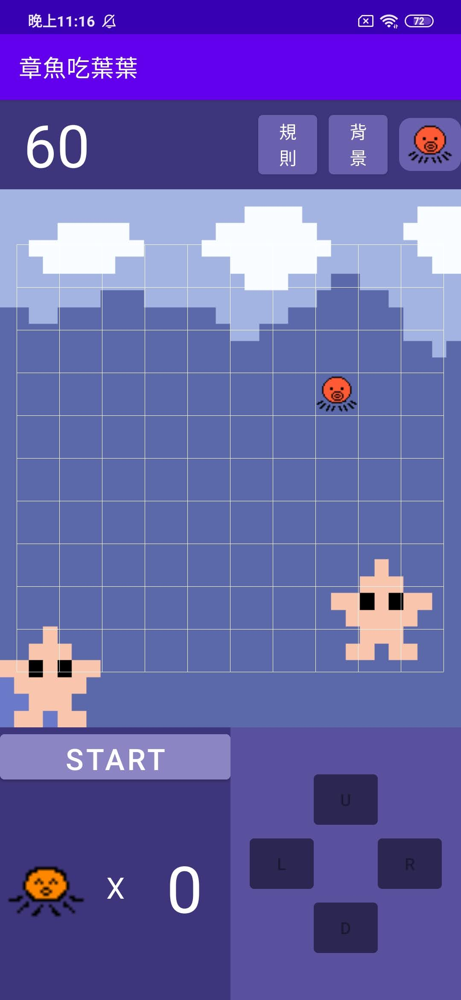
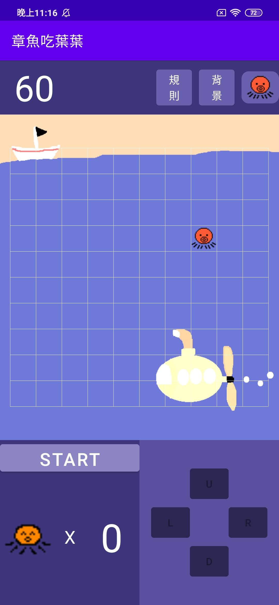
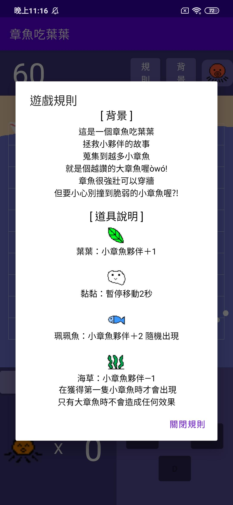
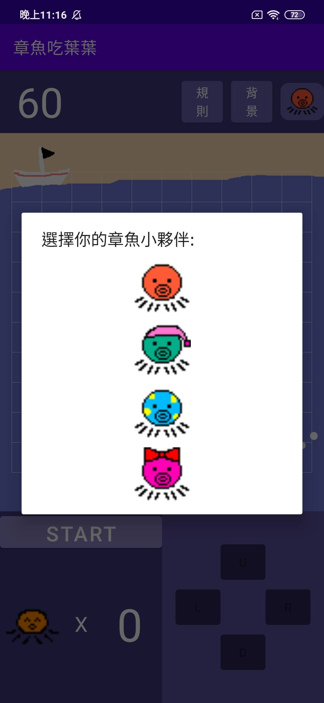
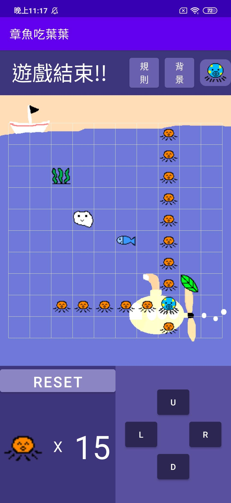
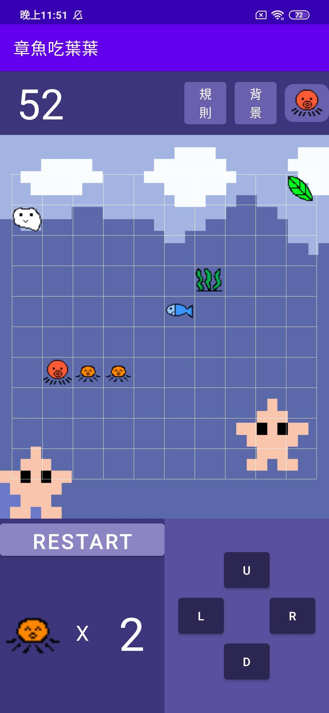

# 手機程式設計期末專題作業
## 章魚吃葉葉 -- 一個不一樣的貪食蛇遊戲

***

## Description
你是一隻大章魚

在深海當中有著許多危險

但你的小章魚寶寶們卻走失在大海當中了

在尋找走失的小章魚同時保護著你身後的小章魚們吧！

***

## Background
這是個從組員發想的遊戲

裡面的所有元素都是我們的組員！

一般的貪食蛇太過無聊

因此我們加上了許多的陷阱與道具！

還能夠自己選擇喜歡的外觀與背景

穿牆的獨特玩法讓玩家需要思考更多操作細節

這是個屬於我們自己的貪食蛇！

***

## Screen Shot
  

  